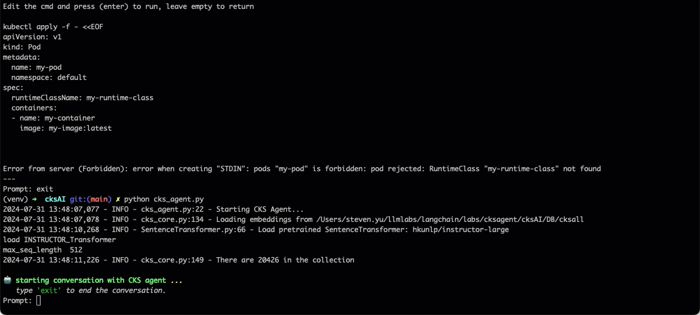
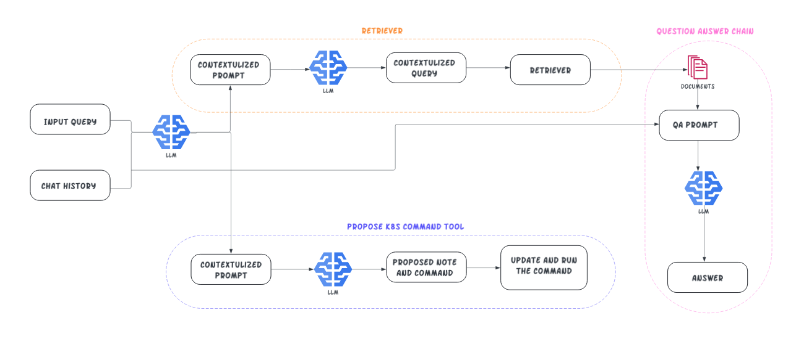

# CKS AI Agent
The Medium article is [A RAG-based CKS AI Agent](https://medium.com/@yuxiaojian/a-rag-based-cks-ai-agent-b36a377b3457)


[CKS](https://www.cncf.io/training/certification/cks/)(Certified Kubernetes Security) AI agent is a RAG (Retrieval-Augmented Generation) enabled GPT to assist preparing the [CKS certification](https://training.linuxfoundation.org/certification/certified-kubernetes-security-specialist/). This agent uses a vector store built from the [CKS allowed resources](https://docs.linuxfoundation.org/tc-docs/certification/certification-resources-allowed#certified-kubernetes-security-specialist-cks). The agent can answer your questions and is also able to interact with your K8s cluster. 

<p align="center">
  
</p>

## How it works
The CKS agent is a Retrieval Augmented Generation (RAG) enabled agent. The backend LLM (gpt-4o) is a powerful :brain: and can reason about wide-ranging topics, but its knowledge is limited to the public data up to a specific point in time that it was trained on. Besides, it was trained with vast amount of data and may not be specialized enough in a specific area. The agent enhances the brain by providing more context via the vector DB so that can get more accurate answers. 

Certified Kubernetes Security Specialist (CKS) is a sought-after certification. Candidates need to solve 16+ questions in real K8s environment within 2 hours. Time is always the most challenging factor. Candidates need to practice a lot and very hands-on before sitting in front of the certification test. The CKS agent also provide a K8s command propose tool for quick interactions. 

LLM is both the controller and consultant here. It decides which tool (retriever or propose a command) to use, generates the query to the retriever and proposes the command to execute. In the end, LLM also provides the best answer. 


<p align="center">
  
</p>


## Usage

### Set up an K8s environment
The agent works best with a testing K8s environment so you can run the command from the agent and check the outputs in live. 

You can follow Kim's [CKS course repository](https://github.com/killer-sh/cks-course-environment) to set up a K8s cluster. Kim also showed a 🎥 [video demo](https://youtu.be/d9xfB5qaOfg?t=14642) on how to make the cluster accessible via `kubectl` on your laptop. 

### Merge the Vector DB files
The vector DB was cut into smaller chunks as there is 50MB file limit. Merge the two files
```bash
cd assets/DB/cksall
cat chroma.sqlite3.* > chroma.sqlite3

cd 1492db33-de49-43c7-b3a8-9f8f8682329d
cat data_level0.bin.* > data_level0.bin
```

### Run the agent
Switch to the project directory
```bash
pip install -r requirements.txt
```

Import OpenAI API key or it will ask you in starting up. The agent uses the `gpt-4o` model (*You can change `OPENAI_MODE` in the config.py*). 
```bash 
export OPENAI_API_KEY="sk-******"
```

Since the OpenAI embedding model has a rate limit and can't create the embeddings for all the docs. The agent uses the [instructor embeddings](https://instructor-embedding.github.io/)  model `hkunlp/instructor-large`. To download it, you will need an [Hugging Face token](https://huggingface.co/docs/hub/en/security-tokens). Once you get the token, first run a [login](https://huggingface.co/docs/huggingface_hub/en/quick-start#:~:text=from%20huggingface_hub%20import%20login%0A%3E%3E%3E%20login())in python as below, it will store the token on your laptop.  

```python
python

>>> from huggingface_hub import login
>>> login()
```
You can then start the agent now
```bash
python cks_agent.py
```

### Rebuild the Vector DB
Delete the current vector DB files `assets/DB/cksall`. Specify your data folder `SOURCE_DIRECTORY` in `config.py`
```bash
python ingest_batch.py

# Or use "-u" to remove the common path in metadata
python ingest_batch.py -u
```


## Built Upon 🧩
- [LangChain](https://github.com/hwchase17/langchain)
- [HuggingFace LLMs](https://huggingface.co/models)
- [InstructorEmbeddings](https://instructor-embedding.github.io/)
- [ChromaDB](https://www.trychroma.com/)
- [Kubernetes CKS Course Environment](https://github.com/killer-sh/cks-course-environment)

## Credits
- The framework is heavily based on [k8sAI](https://github.com/argon-labs/k8sAI) 
- The original `ingest.py` is from [localGPT](https://github.com/PromtEngineer/localGPT)

## Todo

* Warnings
```
2024-07-31 11:21:11,574 - WARNING - manager.py:293 - Error in RootListenersTracer.on_chain_end callback: ValueError()
2024-07-31 11:21:11,575 - WARNING - manager.py:335 - Error in callback coroutine: ValueError()
```
Langchain issue [10460](https://github.com/langchain-ai/langchain/issues/10460)